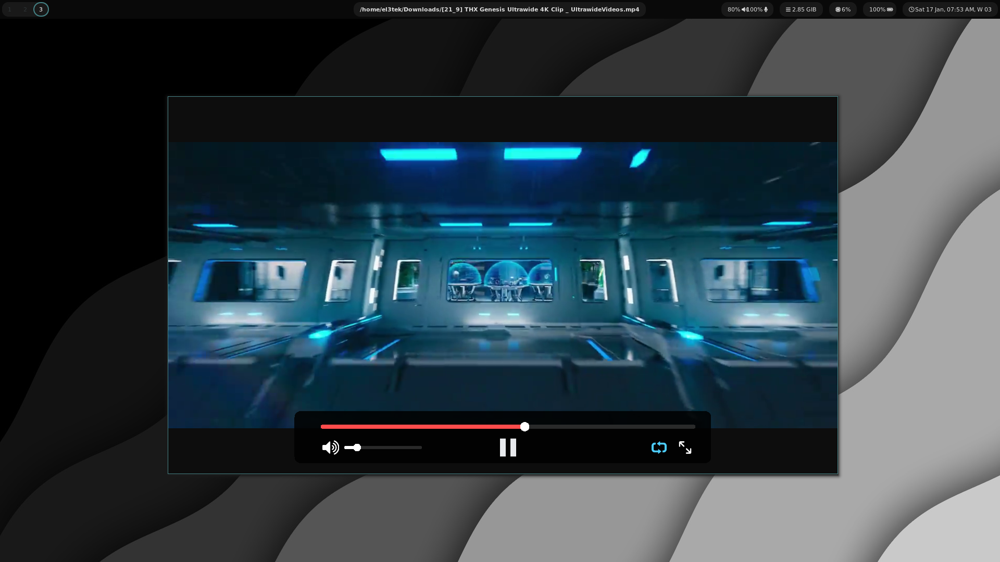

# My Video App (No Name)

**Video application** built from scratch in **C++**, using **OpenGL** for rendering, a custom **UI**, **FFmpeg** for video/audio decoding, and **miniaudio** for audio playback.

The initial idea behind this project was simply to build my own video player for personal use. After facing some issues with other programs that didn’t give me what I needed—basically, just playing videos—they ended up bothering me with things I didn’t care about. So I built this project to give me exactly the performance I wanted, nothing more.

It also started as a learning project. Whenever I needed a reference or a solution for another project, I could use this code as a guide.

## Features
- Lightweight and fast video playback
- Custom UI built from scratch
- Video and audio decoding using FFmpeg and miniaudio
- High performance rendering with OpenGL

## Future Goals
- Hardware acceleration (GPU decoding) for smoother playback
- Playlist support and basic media library
- Subtitle support
- Customizable UI themes
- Basic video controls (speed, loop, frame-by-frame)
